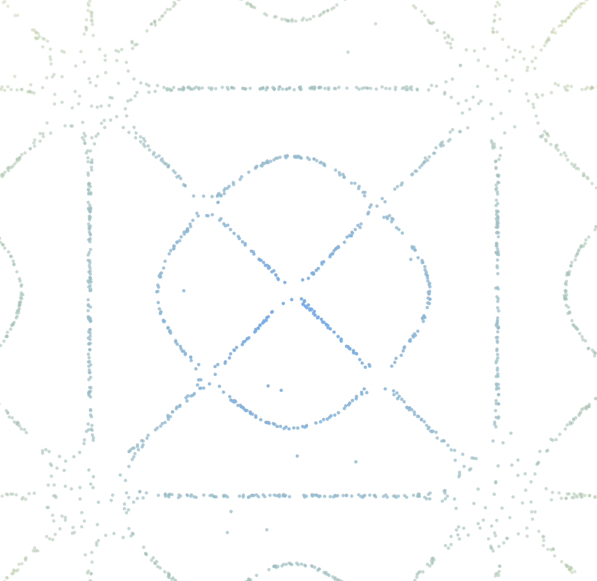
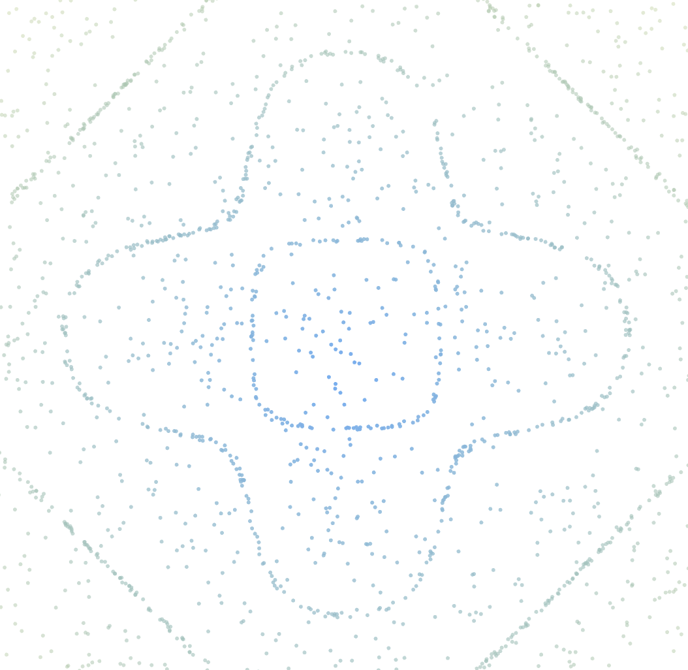
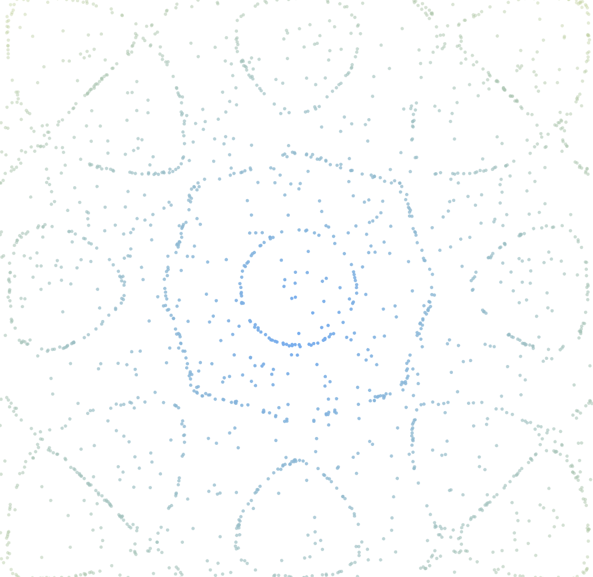
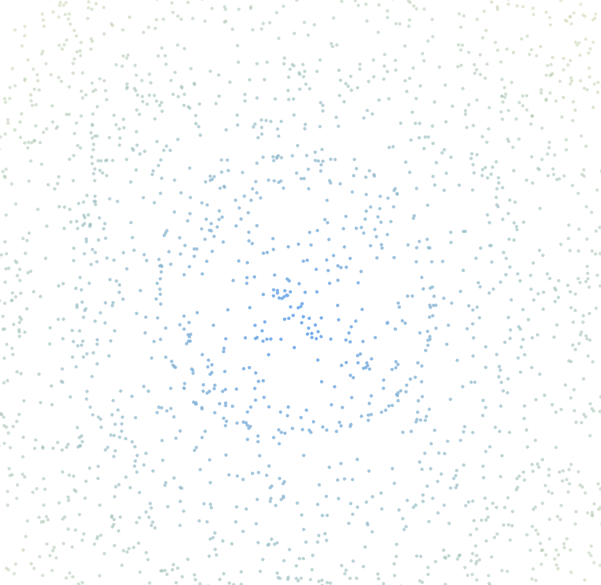

# 🎵 Chladni Plate Simulator 🎵
This program combines art, physics and technolgy through mesmerizing Chladni patterns based on real life experiments! These patterns emerge when sand on a vibrating plate gathers at nodes where there is no movement. Each frequency produces a unique shape, revealing the hidden beauty of sound.

The program simulates these patterns based on the equation developped by Ernest Chladni, using Javascript's p5.js library and applying it in a visual form with HTML and CSS.

# 🎛 How It Works
It sets the values of m and n randomly between 1 and 5 (included).

You can then watch as wave patterns for from the particles, creating unique shapes.

You can click to explore different modes for a different visual effect!

## 📸 Preview

  
  
  
  

🤝 Contributions
Feel free to open issues or submit pull requests to improve the simulation!
